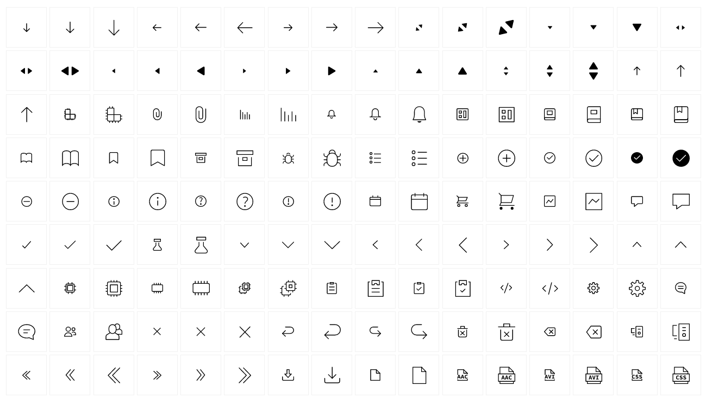

<a name="readme-top"></a>

<!-- PROJECT LOGO -->
<br />
<div align="center">
  <a href="https://infineon.github.io/infineon-design-system-stencil/?path=/story/icons--page">
    
  </a>

  <h3 align="center">infineon-icons</h3>

  <p align="center">
    Include SVG Icons from <a href="https://infineon.github.io/infineon-design-system-stencil/?path=/docs/icon-library--development">Infineon's Icon Library</a> into your project
    <br />
    <a href="https://github.com/infineon/infineon-icons"><strong>Explore the docs »</strong></a>
    <br />
    <br />
    <a href="https://infineon.github.io/infineon-design-system-stencil/?path=/story/icons--page">View Demo</a>
    ·
    <a href="https://github.com/infineon/infineon-icons/issues">Report Bug</a>
    ·
    <a href="https://github.com/infineon/infineon-icons/issues">Request Feature</a>
    ·
    <a href="https://github.com/infineon/infineon-icons/issues">Request Icons</a>
  </p>
</div>


<!-- TABLE OF CONTENTS -->
<details>
  <summary>Table of Contents</summary>
  <ol>
    <li>
      <a href="#about-the-project">About The Project</a>
      <ul>
        <li><a href="#built-with">Built With</a></li>
      </ul>
    </li>
    <li>
      <a href="#getting-access-to-infineons-github-repository">Getting Access to Infineons Github Repository</a>
      <ul>
        <li><a href="#creating-github-account">Creating GitHub Account</a></li>
        <li><a href="#create-configure-pat">Create + Configure PAT</a></li>
      </ul>
    </li>
    <li><a href="#project-configuration">Project configuration</a></li>
    <li>
      <a href="#installation">Installation</a>
      <ul>
        <li><a href="#install-packages">Install packages</a></li>
        <li><a href="#import-component">Import Component</a></li>
        <li><a href="#create-icon-library">Create Icon library</a></li>
      </ul>
    </li>
    <li><a href="#usage">Usage</a></li>
    <li><a href="#usage-of-fonts-in-plain-html">Usage of Fonts in plain HTML</a></li>
    <li><a href="#contributing">Contributing</a></li>
    <li><a href="#license">License</a></li>
    <li><a href="#requesting-new-icons">License</a></li>
    <li><a href="#contact">Contact</a></li>
  </ol>
</details>

<!-- ABOUT THE PROJECT -->
## About The Project

<a href="">
  
</a>Simple library containing Infineon's Icons as SVGs: <a href="https://infineon.github.io/infineon-design-system-stencil/?path=/story/icons--page">Infineons Icon Library</a>.

<p align="right">(<a href="#readme-top">back to top</a>)</p>


<!-- GETTING STARTED -->
## Getting Access to Infineons Github Repository

### Creating GitHub Account
In order to access the npm packages that are available at github you need to create an github account and contact out github admins (Yushev Artem) to be added to the Infineon Company.
<p align="right">(<a href="#readme-top">back to top</a>)</p>

### Create + Configure PAT
1. Create PAT
	follow guide at https://docs.github.com/en/authentication/keeping-your-account-and-data-secure/creating-a-personal-access-token
	give token the "read:packages" scope

2. Authorize PAT with Infineon SSO
	Click on Configure SSO
	Click on Authorize


3. Set global npm config for your pc
```sh
npm config set '//npm.pkg.github.com/:_authToken' '<yourPAThere>'
```
<p align="right">(<a href="#readme-top">back to top</a>)</p>

## Project configuration
1. add a file .npmrc to your project root. It should contain 
 ```@infineon:registry=https://npm.pkg.github.com/ ```
  It is considered best practice to keep package configuration on project level. Please note that
  access configuration should never be added to your source control system, though.

## Installation
### Install Packages
```sh
npm i -S @infineon/infineon-icons
```

### Create Icon Library
create file ./src/plugins/infineonIcons.js
```js
import library from '@infineon/infineon-icons/library';

import {
	cCheck16,
} from '@infineon/infineon-icons';

library.add(
	cCheck16,
);
```
  import this file in your main.js/index.js
```js
import './plugins/infineonIcons'
```

<p align="right">(<a href="#readme-top">back to top</a>)</p>

<!-- USAGE EXAMPLES -->
## Usage

Use the icon component in any template. The icon has to be a string matching the icon name in your library.
The name can be the original file name from figma or camelCase.

Depending on project language, the following shows how to access the icon and its properties:

```js
import library from '@infineon/infineon-icons/library';

const iconObj = library.getIcon('cCheck16');
const height = iconObj.height;
const width = iconObj.width;
const viewbox = `0 0 ${height} ${width}`;
const pathD = iconObj.svgContent.substring(iconObj.svgContent.indexOf('d=') + 3).split("\"/>")[0];
```

Include the icon as an SVG into your project:

```html
<svg width={width} height={height} xmlns="http://www.w3.org/2000/svg" viewBox={viewbox}><path fill="currentColor" d={pathD}/></svg>
```

<p align="right">(<a href="#readme-top">back to top</a>)</p>

## Usage of Fonts in plain HTML

**Overview** The `infineon-icons` package provides a collection of SVG icons and an accompanying icon font. Integrating this font into your HTML project allows you to display icons by simply applying CSS classes to HTML elements, enhancing the visual appeal and user experience of your web pages.

---

**Prerequisites** 
- Basic understanding of HTML and CSS.

- A plain HTML project or webpage where you want to use the icons.


---

Step 1: Obtain the `infineon-icons` Package** **Option 1: Install via NPM** 
If you have Node.js and NPM installed, you can install the package using the following command:


```bash
npm install infineon-icons --save
```
This will download the package into your project's `node_modules` directory.**Option 2: Download Manually** 
If you prefer not to use NPM, you can manually download the package:
 
1. Visit the [NPM package page for infineon-icons](https://www.npmjs.com/package/infineon-icons) .

2. Download the package archive or clone the repository if available.

3. Extract the files to a directory in your project.


---

**Step 2: Include Font Files and CSS in Your Project** **Locate the Necessary Files** 
After obtaining the package, locate the following files:
 
- **Font Files**  (formats like `.ttf`, `.woff`, `.woff2`):

```
infineon-icons.ttf
infineon-icons.woff
infineon-icons.woff2
```
 
- **CSS File** :

```
infineon-icons.css
```
**Copy Files to Your Project** 
Organize the files within your project directory:
 
1. **Create Directories** : 
  - **Fonts Directory** : `assets/fonts/`
 
  - **CSS Directory** : `assets/css/`
 
2. **Copy Font Files** :Copy the font files from `./node_modules/@infineon/infineon-icons/dist/fonts` into the `assets/fonts/` directory.
 
3. **Copy CSS File** :Copy the `infineon-icons.css` file from `./node_modules/@infineon/infineon-icons/dist/fonts` into the `assets/css/` directory.
**Adjust Font Paths in CSS** Open `infineon-icons.css` and update the `@font-face` `src` paths to point to the correct location of the font files relative to the CSS file.

```css
@font-face {
  font-family: "infineon-icons";
  src: url("../fonts/infineon-icons.woff2") format("woff2"),
       url("../fonts/infineon-icons.woff") format("woff"),
       url("../fonts/infineon-icons.ttf") format("truetype");
  font-weight: normal;
  font-style: normal;
}
```


---

**Step 3: Reference the CSS File in Your HTML** Include the CSS file in the `<head>` section of your HTML document.

```html
<!DOCTYPE html>
<html lang="en">
<head>
  <meta charset="UTF-8">
  <title>Infineon Icons Example</title>
  <!-- Include the Infineon Icons CSS -->
  <link rel="stylesheet" href="assets/css/infineon-icons.css">
</head>
<body>
  <!-- Your content will go here -->
</body>
</html>
```


---

**Step 4: Use the Icons in Your HTML** **Understanding the CSS Classes** The `infineon-icons.css` file defines CSS classes for each icon. There is a base class (e.g., `icon`) and modifier classes for each icon (e.g., `icon-home`, `icon-user`).**Example Usage** 

```html
<!-- Antenna Icon -->
<span class="icon icon-antenna" aria-hidden="true"></span>

<!-- Arrow Right Icon -->
<span class="icon icon-arrow-right" aria-hidden="true"></span>

<!-- Beginner Icon -->
<span class="icon icon-beginner" aria-hidden="true"></span>
```
**Find Available Icon Classes** Open `infineon-icons.css` to see the list of available icon classes. Look for classes defined like:

```css
.icon-antenna::before {
  content: "\e905";
}

.icon-arrow-right::before {
  content: "\e90b";
}

/* ...and so on */
```


---


**Accessibility Considerations** Ensuring your website is accessible to all users, including those with disabilities, is crucial. Below are guidelines to make your use of `infineon-icons` icon font more accessible.Use `aria-hidden="true"` for Decorative Icons**  
- **Purpose** : Decorative icons do not convey essential information and should be hidden from assistive technologies to avoid confusion.
 
- **Action** : Add `aria-hidden="true"` to icons that are purely decorative.

```html
<!-- Decorative icon -->
<span class="icon icon-decorative" aria-hidden="true"></span>
```
**Use Tooltips**  
- **Purpose** : Tooltips provide additional context or information about an icon when a user hovers over it.
 
- **Action** : Use the `title` attribute to add tooltips to icons, and provide accessible text using `aria-label` if the icon is interactive.

```html
<!-- Icon with tooltip -->
<button aria-label="Help">
  <span class="icon icon-help" aria-hidden="true" title="Get Help"></span>
</button>
```
**Note** : The `title` attribute may not be consistently read by screen readers, so always pair it with `aria-label` for accessibility.
Use `role="img"` When Appropriate**  
- **Purpose** : When an icon conveys important information or serves as the sole content within an element, use `role="img"` to indicate it's an image.
 
- **Action** : Apply `role="img"` and provide an `aria-label` to describe the icon's purpose.

```html
<!-- Icon conveying important information -->
<span class="icon icon-warning" role="img" aria-label="Warning: Action Required"></span>
```
**Implementing a Visually Hidden Class**  
- **Purpose** : Visually hidden text provides information to screen readers without displaying it on the screen.
 
- **Action** : Use a CSS class to hide text visually but keep it accessible to assistive technologies.

```css
.visually-hidden {
  position: absolute;
  width: 1px;
  height: 1px;
  padding: 0;
  margin: -1px;
  overflow: hidden;
  clip: rect(0, 0, 0, 0);
  white-space: nowrap;
  border: 0;
}
```
**Usage Example:** 

```html
<button>
  <span class="icon icon-delete" aria-hidden="true"></span>
  <span class="visually-hidden">Delete item</span>
</button>
```

In this example, the visible icon is hidden from screen readers, while the text "Delete item" is hidden visually but read by screen readers.


---

**Advanced Usage** **Using Icons in Buttons or Links** 

```html
<!-- Icon with text label -->
<button>
  <span class="icon icon-download" aria-hidden="true"></span> Download
</button>

<!-- Icon-only button with accessible label -->
<button aria-label="Refresh">
  <span class="icon icon-refresh" aria-hidden="true"></span>
</button>
```
**Styling Icons with Pseudo-elements** 
You can apply icons using CSS pseudo-elements to keep your HTML cleaner.


```css
/* CSS */
.button-print::before {
  content: "";
  display: inline-block;
  font-family: "infineon-icons";
  font-style: normal;
  font-weight: normal;
  speak: none;
  font-size: 16px;
  line-height: 1;
  vertical-align: middle;
  margin-right: 8px;
  /* Use the appropriate Unicode from the CSS */
  content: "\e903"; /* Replace with the desired icon code */
}
```


```html
<!-- HTML -->
<button class="button-print">Print Page</button>
```
**Ensuring Keyboard Accessibility** 
Make sure all interactive elements are focusable and operable via keyboard.


```html
<!-- Focusable button with icon -->
<button aria-label="Close">
  <span class="icon icon-close" aria-hidden="true"></span>
</button>
```


---

**Example Project Structure** 

```
project/
├── assets/
│   ├── css/
│   │   ├── infineon-icons.css
│   │   └── styles.css
│   └── fonts/
│       ├── infineon-icons.ttf
│       ├── infineon-icons.woff
│       └── infineon-icons.woff2
├── index.html
└── other-files...
```
---

**Troubleshooting** **Icons Not Displaying**  
- **Check Font Paths** : Ensure the paths in the `@font-face` declaration within `infineon-icons.css` correctly point to the font files.
 
- **File Names** : Verify that the font file names match those referenced in the CSS file.
 
- **Browser Cache** : Clear your browser cache to make sure it's loading the latest files.

- **Incorrect Icon Appearing** : Make sure the Unicode values in the CSS correspond to the correct icons.
 
- **Class Names** : Verify that you're using the correct class names as defined in `infineon-icons.css`.

- **CSS Specificity** : If your icons aren't styling as expected, check if other CSS rules are overriding your styles.
 
- **Font Size and Line Height** : Adjust `font-size` and `line-height` to achieve the desired appearance.


---

**Additional Resources**  
- **Infineon Icons NPM Page** : [npmjs.com/package/infineon-icons](https://www.npmjs.com/package/infineon-icons)
 
- **Web Accessibility Initiative (WAI)** : [Using ARIA](https://www.w3.org/WAI/ARIA/apg/)
 
- **MDN Web Docs** : 
  - [ARIA Techniques](https://developer.mozilla.org/en-US/docs/Web/Accessibility/ARIA/ARIA_Techniques)
 
  - [@font-face](https://developer.mozilla.org/en-US/docs/Web/CSS/@font-face)
 

- **WCAG Guidelines** : [Web Content Accessibility Guidelines (WCAG) 2.1](https://www.w3.org/TR/WCAG21/)
 
- **CSS-Tricks** : [Using Icon Fonts in Your Website](https://css-tricks.com/examples/IconFont/)


---

**Feel free to reach out if you have any more questions or need further assistance!**


<!-- CONTRIBUTING -->
## Contributing

Contributions are what make the open source community such an amazing place to learn, inspire, and create. Any contributions you make are **greatly appreciated**.

If you have a suggestion that would make this better, please fork the repo and create a pull request. You can also simply open an issue with the tag "enhancement".

1. Fork the Project
2. Create your Feature Branch (`git checkout -b feature/AmazingFeature`)
3. Commit your Changes (`git commit -m 'Add some AmazingFeature'`)
4. Push to the Branch (`git push origin feature/AmazingFeature`)
5. Open a Pull Request

<p align="right">(<a href="#readme-top">back to top</a>)</p>

## Requesting new Icons

If you need new icons that are currently not in our icon library please create an issue in our infineon-icons project <a href="https://github.com/infineon/infineon-icons/issues">here</a>.

If you already have an SVG-Icon you can always just place it in the svg folder at <a href="https://github.com/infineon/infineon-icons/issues">our infineon-icons project</a> and create a pull request.

<p align="right">(<a href="#readme-top">back to top</a>)</p>


<!-- LICENSE -->
## License

Distributed under the MIT License. See `LICENSE.txt` for more information.

<p align="right">(<a href="#readme-top">back to top</a>)</p>


<!-- CONTACT -->
## Contact

Benedikt Kämmerer - Benedikt.Kaemmerer@infineon.com
Tihomir Yanchev - Tihomir.Yanchev-EE@infineon.com
Verena Lechner - verena.lechner@infineon.com

Project Link: [https://github.com/infineon/infineon-icons](https://github.com/infineon/infineon-icons)

<p align="right">(<a href="#readme-top">back to top</a>)</p>

[contributors-shield]: https://img.shields.io/github/contributors/Infineon/infineon-icons.svg?style=for-the-badge
[contributors-url]: https://github.com/Infineon/infineon-icons/graphs/contributors
[forks-shield]: https://img.shields.io/github/forks/Infineon/infineon-icons.svg?style=for-the-badge
[forks-url]: https://github.com/Infineon/infineon-icons/network/members
[stars-shield]: https://img.shields.io/github/stars/Infineon/infineon-icons.svg?style=for-the-badge
[stars-url]: https://github.com/Infineon/infineon-icons/stargazers
[issues-shield]: https://img.shields.io/github/issues/Infineon/infineon-icons.svg?style=for-the-badge
[issues-url]: https://github.com/Infineon/infineon-icons/issues
[license-shield]: https://img.shields.io/github/license/Infineon/infineon-icons.svg?style=for-the-badge
[license-url]: https://github.com/Infineon/infineon-icons/blob/master/LICENSE.txt
